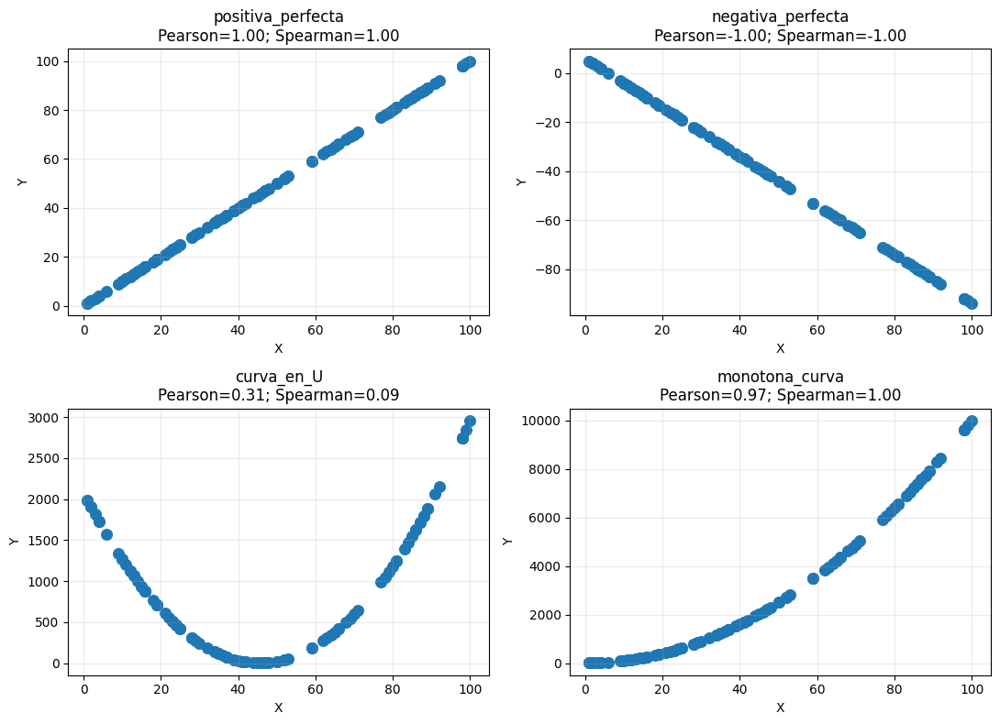
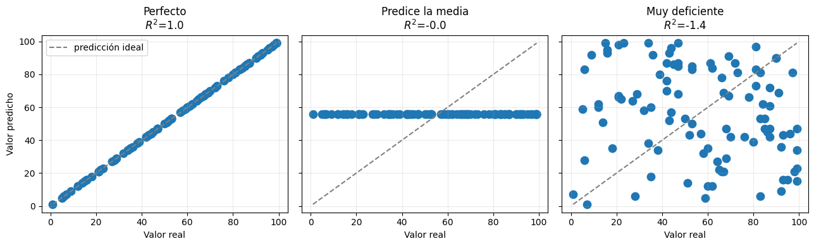
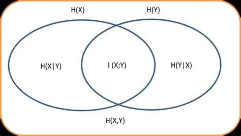
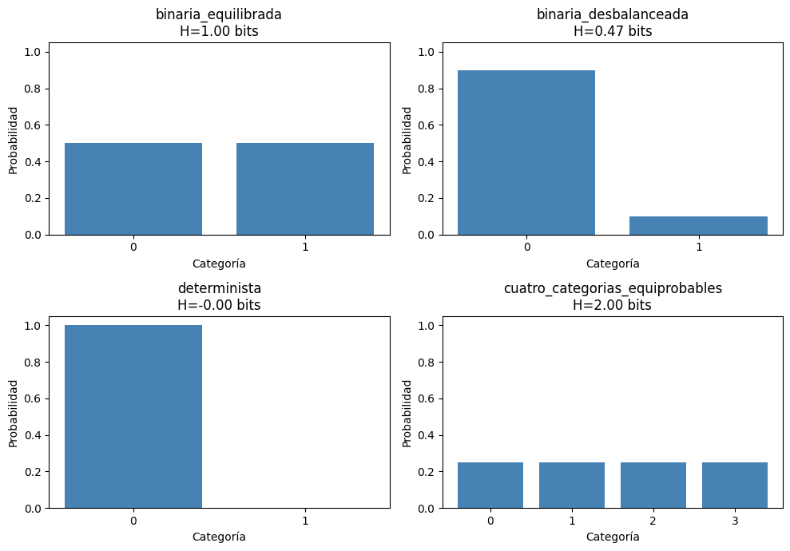
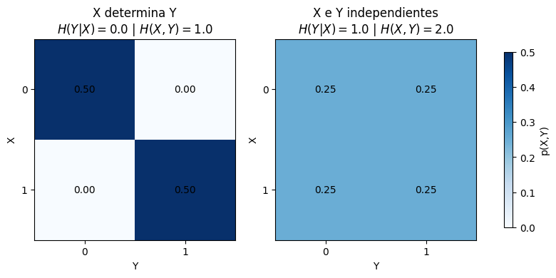
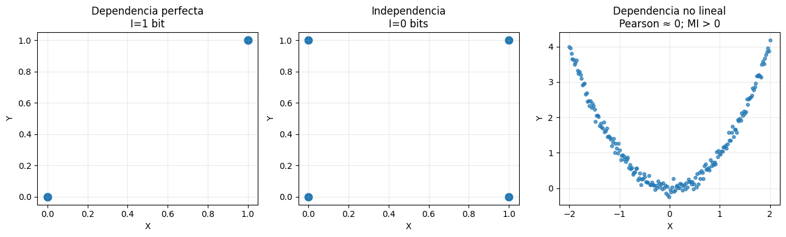

# Métricas de calidad y contenido de información de los atributos

**Materia:** Ciencia de Datos  
**Duración:** 2 horas (120 minutos)  
**Tema:** Métricas para describir la calidad, dependencia y contenido de información
de variables o *features*

Este material está diseñado para desarrollarse en un notebook de Jupyter,
Google Colab o VS Code. Los ejemplos usan un problema de clasificación, pero
las ideas también se pueden aplicar a regresión con los ajustes indicados.

> **Idea central:** no existe una única medida de calidad para una variable.
> Cada métrica observa una propiedad diferente: asociación, incertidumbre,
> dependencia, capacidad predictiva o utilidad dentro de un modelo. Una
> interpretación correcta siempre debe considerar el tipo de variable, la
> escala, el tamaño de muestra y el contexto del problema.

---

## 1. Propósito de la clase

Al terminar la sesión, el estudiante podrá:

- distinguir relevancia, redundancia, incertidumbre y estabilidad;
- seleccionar una métrica apropiada según el tipo de variable y problema;
- calcular e interpretar correlación de Pearson, $R^2$, entropía,
  información mutua, MDI, importancia por
  permutación y ReliefF;
- explicar las limitaciones de cada métrica;
- distinguir una medida descriptiva de una métrica de desempeño;
- evitar interpretar asociación como causalidad.

### ¿Qué métricas conviene comparar?

Las métricas no son intercambiables. **Pearson** y **Spearman** resumen
asociaciones; **entropía** e **información mutua**
cuantifican incertidumbre y dependencia; **MDI** y **permutación** describen la
contribución de una variable a un modelo; y **ReliefF** observa diferencias
locales entre vecinos. La comparación de varias perspectivas es más
informativa que ordenar variables con un único número.

---

## 2. Preparación

```python
import numpy as np
import pandas as pd
import matplotlib.pyplot as plt

from sklearn.datasets import load_breast_cancer
from sklearn.ensemble import RandomForestClassifier
from sklearn.feature_selection import mutual_info_classif
from sklearn.inspection import permutation_importance
from sklearn.linear_model import LinearRegression
from sklearn.metrics import r2_score
from sklearn.model_selection import train_test_split
from sklearn.pipeline import Pipeline
from sklearn.preprocessing import StandardScaler

pd.set_option("display.float_format", "{:.4f}".format)
```

Usaremos un conjunto de datos de diagnóstico médico. Para estimar una métrica
dependiente del modelo, el modelo debe ajustarse únicamente con los datos de
entrenamiento de cada partición de validación.

```python
datos = load_breast_cancer(as_frame=True)
X = datos.data
y = datos.target

X_train, X_test, y_train, y_test = train_test_split(
    X,
    y,
    test_size=0.20,
    stratify=y,
    random_state=42,
)

print(X.shape)
print(y.value_counts(normalize=True))
```

---

## 3. Antes de medir: qué significa calidad

Para una variable $X_j$, conviene analizar al menos cinco dimensiones:

1. **Relevancia:** ¿aporta información sobre $Y$?
2. **Redundancia:** ¿repite información que ya aportan otras variables?
3. **Estabilidad:** ¿su utilidad se mantiene en otras muestras o períodos?
4. **Completitud y consistencia:** ¿tiene valores faltantes, atípicos o
   codificaciones contradictorias?
5. **Costo y disponibilidad:** ¿se puede medir en producción y está disponible
   en el momento en que se necesita la predicción?

Una métrica univariada evalúa un atributo de forma aislada. Puede pasar por
alto una variable que solo sea útil en combinación con otra, o puede premiar
variables redundantes. Por eso ningún valor numérico debe interpretarse sin
conocer la distribución de los datos y el propósito del análisis.

### Tres perspectivas de medición

| Perspectiva | Ejemplos | Qué responde | Riesgo o limitación |
| --- | --- | --- | --- |
| **Descriptiva** | Pearson, Spearman, entropía | ¿Cómo se distribuye o asocia la variable? | No demuestra capacidad predictiva |
| **Información** | entropía, información mutua | ¿Cuánta incertidumbre se reduce? | Depende de la estimación y la discretización |
| **Dependiente del modelo** | MDI, permutación, ReliefF | ¿Cómo contribuye al desempeño o a la separación? | Depende del modelo, vecinos y datos usados |

---

## 4. Métricas de calidad y contenido de información

### 4.1 Correlación de Pearson

La correlación de Pearson mide la fuerza y dirección de una **relación lineal**
entre dos variables:

$$
r_{XY} = \frac{\operatorname{cov}(X,Y)}{\sigma_X \sigma_Y}
$$

Su valor está entre -1 y 1. Un valor cercano a 1 indica relación lineal
positiva; uno cercano a -1, relación lineal negativa; y uno cercano a 0,
ausencia de relación lineal.

```python
correlaciones = (
    X_train.assign(objetivo=y_train)
    .corr(numeric_only=True)["objetivo"]
    .drop("objetivo")
    .sort_values(key=np.abs, ascending=False)
)

print(correlaciones.head(10))
```

**Advertencias:**

- correlación no implica causalidad;
- Pearson puede ser bajo frente a una relación curva;
- los valores atípicos pueden cambiar mucho el resultado;
- para clasificación binaria, correlacionar el objetivo 0/1 es una medida
  descriptiva, no una prueba completa de relevancia.

Para relaciones monotónicas no lineales puede compararse con Spearman:

```python
spearman = (
    X_train.assign(objetivo=y_train)
    .corr(method="spearman", numeric_only=True)["objetivo"]
    .drop("objetivo")
    .abs()
    .sort_values(ascending=False)
)
print(spearman.head(10))
```

#### Ejemplo y casos extremos: Pearson y Spearman

```python
x = np.random.randint(1, 101, size=100)

mean = np.mean(x)

ejemplos_correlacion = pd.DataFrame({
    "positiva_perfecta": x,
    "negativa_perfecta": 6 - x,
    "curva_en_U": (x - mean) ** 2,
    "monotona_curva": x ** 2,
})

for nombre in ejemplos_correlacion:
    z = ejemplos_correlacion[nombre]
    print(
        nombre,
        "Pearson =", round(pd.Series(x).corr(pd.Series(z)), 3),
        "Spearman =", round(pd.Series(x).corr(pd.Series(z), method="spearman"), 3),
    )

# Cada panel muestra la forma de la relación y los dos coeficientes.
fig, axes = plt.subplots(2, 2, figsize=(11, 8))
for ax, (nombre, z) in zip(axes.ravel(), ejemplos_correlacion.items()):
    pearson = pd.Series(x).corr(pd.Series(z))
    spearman_rho = pd.Series(x).corr(pd.Series(z), method="spearman")
    ax.scatter(x, z, s=70)
    ax.set_title(f"{nombre}\nPearson={pearson:.2f}; Spearman={spearman_rho:.2f}")
    ax.set_xlabel("X")
    ax.set_ylabel("Y")
    ax.grid(alpha=0.25)
plt.tight_layout()
plt.show()
```



- **Relación positiva perfecta:** si $Y=2X+1$, Pearson y Spearman valen $1$.
- **Relación negativa perfecta:** si $Y=6-X$, ambos valen $-1$.
- **Relación en U:** Pearson puede ser $0$ aunque $Y$ dependa completamente de
  $X$. Spearman también puede ser cercano a cero porque la relación no es
  monotónica.
- **Relación monotónica curva:** para $Y=X^2$ con $X>0$, Spearman vale $1$,
  mientras Pearson puede ser menor que $1$ porque la relación no es lineal.
- **Variable constante:** si $X=[3,3,3,3]$, su desviación estándar es cero y la
  correlación queda indefinida (`NaN`).
- **Empates:** Spearman admite valores repetidos mediante rangos promedio, pero
  una gran cantidad de empates reduce la información disponible.
- **Valor atípico:** un solo punto muy alejado puede llevar Pearson desde un
  valor bajo hasta uno cercano a $1$ o $-1$; siempre conviene acompañarlo con
  un diagrama de dispersión.

### 4.2 $R^2$: proporción de variabilidad explicada

El coeficiente de determinación se define como:

$$
R^2 = 1 - \frac{\sum_i(y_i-\hat y_i)^2}
{\sum_i(y_i-\bar y)^2}
$$

En regresión, $R^2$ cuantifica qué proporción de la variabilidad de $Y$
explica el modelo. No debe confundirse con la correlación: en una regresión
lineal simple con intercepto, $R^2=r^2$, pero en modelos múltiples esa
igualdad ya no aplica.

```python
# Ejemplo pequeño de regresión.
x_r2 = np.array([1, 2, 3, 4, 5]).reshape(-1, 1)
y_r2 = np.array([2.1, 3.9, 6.2, 7.8, 10.1])

modelo_r2 = LinearRegression().fit(x_r2, y_r2)
pred_r2 = modelo_r2.predict(x_r2)
print(f"R² = {r2_score(y_r2, pred_r2):.4f}")
```

Para un problema de regresión, se calcularía `r2_score(y_test, predicciones)`
sobre datos no usados para ajustar el modelo. Un $R^2$ alto no garantiza
causalidad, generalización ni que cada atributo individual sea útil.

#### Casos extremos de $R^2$

- **$R^2=1$:** las predicciones coinciden exactamente con los valores reales.
- **$R^2=0$:** el modelo no mejora la predicción constante $\bar y$ en los
  datos evaluados.
- **$R^2<0$:** es posible en prueba; significa que el modelo es peor que
  predecir siempre la media de esa muestra. Por ejemplo:

```python
x = np.random.randint(1, 101, size=100)
y_real = x 

mean = np.mean(x)

predicciones_r2 = {
    "Perfecto": x,
    "Predice la media": np.full_like(x, mean),
    "Muy deficiente": x[::-1],
}

fig, axes = plt.subplots(1, 3, figsize=(13, 4), sharex=True, sharey=True)

# Calculamos los límites para la línea ideal dinámicamente
min_val, max_val = x.min(), x.max() 

for ax, (nombre, y_pred) in zip(axes, predicciones_r2.items()):
    valor_r2 = r2_score(y_real, y_pred)
    print(nombre, valor_r2)
    ax.scatter(y_real, y_pred, s=80)
    
    # Línea ideal ajustada al nuevo rango
    ax.plot([min_val, max_val], [min_val, max_val], "--", color="gray", label="predicción ideal") 
    
    ax.set_title(f"{nombre}\n$R^2$={valor_r2:.1f}")
    ax.set_xlabel("Valor real")
    ax.grid(alpha=0.25)

axes[0].set_ylabel("Valor predicho")
axes[0].legend()
plt.tight_layout()
plt.show()
```



- **Objetivo constante:** si todos los valores de $Y$ son iguales, la suma
  total de cuadrados es cero y la definición habitual queda indeterminada.
  `scikit-learn` usa por defecto valores finitos convencionales para evitar
  contaminar procesos de validación.
- **Evaluación en entrenamiento:** un modelo flexible puede obtener un valor
  artificialmente alto por sobreajuste; debe reportarse también en validación
  o prueba.

### 4.3 Entropía

La entropía de Shannon mide la incertidumbre de una variable discreta:

$$
H(Y)=-\sum_y p(y)\log_2 p(y)
$$

Si todas las clases están equilibradas, la incertidumbre es mayor; si una clase
domina por completo, la entropía es cero. La entropía sola describe la
distribución de $Y$, no la relevancia de un atributo. Para una variable con
$K$ categorías, su valor máximo es $\log_2(K)$ bits. Por ejemplo, una
variable binaria equilibrada tiene una entropía de 1 bit.

Para comprender la información mutua entre un atributo $X$ y el objetivo $Y$,
se calcula la entropía condicional:

$$
H(Y\mid X)=\sum_x p(x)H(Y\mid X=x)
$$

#### Diagrama de Venn: entropía e información mutua

El siguiente esquema representa los bits de incertidumbre de $X$ y $Y$.
La intersección es la información compartida y equivale a la información
mutua; la parte de $Y$ que queda fuera de la intersección es
$H(Y\mid X)$.



En un diagrama de conjuntos tradicional, $H(X)$ y $H(Y)$ son círculos y
la intersección $I(X;Y)$ representa la dependencia compartida. No se debe
interpretar el área geométrica como una escala exacta: es una representación
conceptual de las relaciones entre las cantidades.

Las relaciones principales del diagrama son:

$$
H(Y) = I(X;Y) + H(Y\mid X)
$$

$$
H(X,Y) = H(X) + H(Y\mid X)
$$

```python
def entropia(probabilidades):
    probabilidades = np.asarray(probabilidades, dtype=float)
    probabilidades = probabilidades[probabilidades > 0]
    return -(probabilidades * np.log2(probabilidades)).sum()

proporciones = y_train.value_counts(normalize=True).to_numpy()
print(f"Entropía del objetivo: {entropia(proporciones):.4f} bits")
```

#### Ejemplos y casos extremos de entropía

```python
casos_entropia = {
    "binaria_equilibrada": [0.5, 0.5],
    "binaria_desbalanceada": [0.9, 0.1],
    "determinista": [1.0, 0.0],
    "cuatro_categorias_equiprobables": [0.25] * 4,
}

for nombre, p in casos_entropia.items():
    print(nombre, f"{entropia(p):.4f} bits")

fig, axes = plt.subplots(2, 2, figsize=(10, 7))
for ax, (nombre, p) in zip(axes.ravel(), casos_entropia.items()):
    ax.bar(range(len(p)), p, color="steelblue")
    ax.set_ylim(0, 1.05)
    ax.set_title(f"{nombre}\nH={entropia(p):.2f} bits")
    ax.set_xlabel("Categoría")
    ax.set_ylabel("Probabilidad")
    ax.set_xticks(range(len(p)))
plt.tight_layout()
plt.show()
```



- **Mínimo:** $H(Y)=0$ cuando una categoría tiene probabilidad $1$; observar
  $Y$ no produce sorpresa.
- **Máximo:** con $K$ categorías, $H(Y)=\log_2 K$ cuando todas son igualmente
  probables. Para cuatro categorías, el máximo es $2$ bits.
- **Categorías imposibles:** los términos con $p=0$ contribuyen $0$, usando la
  convención $0\log 0=0$.
- **Muestra pequeña:** categorías raras no observadas reciben frecuencia cero,
  por lo que la entropía empírica suele subestimar la incertidumbre real.

La entropía condicional y la entropía conjunta pueden calcularse mediante una
tabla de contingencia:

```python
import numpy as np
import pandas as pd
import matplotlib.pyplot as plt

# 1. Entropía base (H)
def entropia(probabilidades):
    # Filtramos probabilidades mayores a 0 para evitar log2(0)
    p = probabilidades[probabilidades > 0]
    return -np.sum(p * np.log2(p))

# 2. Entropía Condicional H(Y|X)
def entropia_condicional(y, x):
    tabla = pd.crosstab(x, y, normalize=True)
    px = tabla.sum(axis=1)
    return sum(px.loc[v] * entropia(tabla.loc[v].to_numpy() / px.loc[v]) 
               for v in tabla.index if px.loc[v] > 0)

# 3. Entropía Conjunta H(X,Y)
def entropia_conjunta(x, y):
    # Calculamos la entropía sobre todas las celdas de la matriz conjunta
    tabla = pd.crosstab(x, y, normalize=True).to_numpy().flatten()
    return entropia(tabla)

# --- Datos ---
X_ej = np.array([0, 0, 1, 1])
Y_ej = np.array([0, 0, 1, 1])

X_ind = np.array([0, 0, 1, 1])
Y_ind = np.array([0, 1, 0, 1])

# --- Gráficos y Resultados ---
fig, axes = plt.subplots(1, 2, figsize=(10, 4))
casos = [
    (axes[0], "X determina Y", X_ej, Y_ej),
    (axes[1], "X e Y independientes", X_ind, Y_ind),
]

for ax, titulo, x_caso, y_caso in casos:
    h_condicional = entropia_condicional(y_caso, x_caso)
    h_conjunta = entropia_conjunta(x_caso, y_caso)
    
    # Imprimimos en consola
    print(f"--- {titulo} ---")
    print(f"H(Y|X) = {h_condicional:.1f} bits")
    print(f"H(X,Y) = {h_conjunta:.1f} bits\n")
    
    conjunta = pd.crosstab(x_caso, y_caso, normalize=True)
    imagen = ax.imshow(conjunta, cmap="Blues", vmin=0, vmax=0.5)
    
    for i in range(conjunta.shape[0]):
        for j in range(conjunta.shape[1]):
            ax.text(j, i, f"{conjunta.iloc[i, j]:.2f}", ha="center", va="center")
            
    # Agregamos las métricas al título para verlas en la imagen
    ax.set_title(f"{titulo}\n$H(Y|X)={h_condicional:.1f}$ | $H(X,Y)={h_conjunta:.1f}$")
    ax.set_xlabel("Y")
    ax.set_ylabel("X")
    ax.set_xticks(range(conjunta.shape[1]), conjunta.columns)
    ax.set_yticks(range(conjunta.shape[0]), conjunta.index)

fig.colorbar(imagen, ax=axes, label="p(X,Y)", shrink=0.8)
plt.show()
```



- **$H(Y\mid X)=0$:** conocer $X$ determina completamente a $Y$.
- **$H(Y\mid X)=H(Y)$:** conocer $X$ no reduce la incertidumbre de $Y$, como
  ocurre bajo independencia.
- **Entropía conjunta:** $H(X,Y)$ es mínima ($0$) si el par es constante y
  satisface $\max(H(X),H(Y))\leq H(X,Y)\leq H(X)+H(Y)$. El límite superior se
  alcanza cuando $X$ e $Y$ son independientes.

La entropía requiere discretizar una variable continua si se calcula de forma
manual. La discretización introduce decisiones y posibles sesgos; por ello es
preferible utilizar una implementación de información mutua que estime la
dependencia directamente.

### 4.4 Información mutua

La información mutua mide la información compartida entre $X$ y $Y$ y la
reducción promedio de incertidumbre de $Y$ al observar $X$:

$$
I(X;Y)=H(Y)-H(Y\mid X)
$$

También puede expresarse como:

$$
I(X;Y)=\sum_{x,y}p(x,y)\log_2
\left(\frac{p(x,y)}{p(x)p(y)}\right)
$$

Es cero cuando las variables son independientes y detecta dependencias
lineales y no lineales. A diferencia de Pearson, no supone una relación
recta. Es simétrica, $I(X;Y)=I(Y;X)$, y no indica causalidad ni dirección.
Su valor está en bits y no tiene un máximo universal: puede crecer con la
entropía de las variables. Para comparar objetivos con distinta incertidumbre
se puede usar la información mutua normalizada.

En datos discretos se estima contando frecuencias conjuntas; con variables
continuas se necesitan estimadores basados en vecinos o discretización. Por
ello, el tamaño de muestra, el ruido y la elección del estimador afectan el
resultado. Una información mutua alta significa dependencia, no necesariamente
utilidad práctica ni una relación causal.

```python
mi = mutual_info_classif(X_train, y_train, random_state=42)
tabla_mi = (
    pd.DataFrame({"atributo": X_train.columns, "informacion_mutua": mi})
    .sort_values("informacion_mutua", ascending=False)
)
print(tabla_mi.head(10))
```

#### Ejemplos y casos extremos de información mutua

```python
from sklearn.metrics import mutual_info_score

x_mi = np.array([0, 0, 1, 1])
y_igual = np.array([0, 0, 1, 1])
y_independiente = np.array([0, 1, 0, 1])

# mutual_info_score usa logaritmo natural: el resultado se convierte a bits.
print("Dependencia perfecta:",
      mutual_info_score(x_mi, y_igual) / np.log(2), "bits")
print("Independencia:",
      mutual_info_score(x_mi, y_independiente) / np.log(2), "bits")

# Comparación visual: dependencia perfecta, independencia y dependencia no lineal.
rng_mi = np.random.default_rng(7)
x_curva = np.linspace(-2, 2, 200)
y_curva = x_curva**2 + rng_mi.normal(0, 0.12, size=x_curva.size)

fig, axes = plt.subplots(1, 3, figsize=(13, 4))
axes[0].scatter(x_mi, y_igual, s=80)
axes[0].set_title("Dependencia perfecta\nI=1 bit")
axes[1].scatter(x_mi, y_independiente, s=80)
axes[1].set_title("Independencia\nI=0 bits")
axes[2].scatter(x_curva, y_curva, s=14, alpha=0.7)
axes[2].set_title("Dependencia no lineal\nPearson ≈ 0; MI > 0")
for ax in axes:
    ax.set_xlabel("X")
    ax.set_ylabel("Y")
    ax.grid(alpha=0.25)
plt.tight_layout()
plt.show()
```



- **Mínimo:** $I(X;Y)=0$ bajo independencia.
- **Máximo respecto a variables discretas dadas:**
  $I(X;Y)\leq\min(H(X),H(Y))$. Si $X=Y$ y ambas son binarias equilibradas,
  la información mutua es $1$ bit.
- **Dependencia determinista no invertible:** si $Y=f(X)$, entonces
  $I(X;Y)=H(Y)$, aunque $Y$ no permita recuperar completamente a $X$.
- **Relación no lineal:** si $Y=X^2$ y $X$ toma valores simétricos, Pearson
  puede ser cero, mientras la información mutua es positiva.
- **Estimación finita:** un estimador puede devolver una cantidad pequeña
  aunque las variables sean independientes. Algunas implementaciones truncan
  estimaciones negativas a cero.
- **Variables continuas idénticas:** en la teoría ideal, la información mutua
  de $X$ consigo misma puede no ser finita; en datos reales el valor reportado
  depende del estimador, el ruido y la resolución.

### 4.5 MDI: Mean Decrease in Impurity

La importancia MDI es la disminución promedio de impureza producida por un
atributo en los nodos de un conjunto de árboles. En clasificación, la
impureza suele ser Gini o entropía. En scikit-learn se obtiene con
`feature_importances_`.

```python
bosque = RandomForestClassifier(
    n_estimators=300,
    random_state=42,
    n_jobs=-1,
)
bosque.fit(X_train, y_train)

mdi = (
    pd.Series(bosque.feature_importances_, index=X_train.columns)
    .sort_values(ascending=False)
)
print(mdi.head(10))
```

#### Ejemplo y casos extremos de MDI

```python
rng = np.random.default_rng(42)
n = 1000
x_util = rng.normal(size=n)
y_demo = (x_util > 0).astype(int)
X_demo = pd.DataFrame({
    "util": x_util,
    "copia_util": x_util,
    "ruido": rng.normal(size=n),
    "constante": 1,
})

rf_demo = RandomForestClassifier(n_estimators=200, random_state=42)
rf_demo.fit(X_demo, y_demo)
mdi_demo = pd.Series(rf_demo.feature_importances_, index=X_demo.columns)
print(mdi_demo)

ax = mdi_demo.sort_values().plot.barh(figsize=(8, 4), color="seagreen")
ax.set_title("MDI: importancia repartida entre atributos redundantes")
ax.set_xlabel("Disminución media de impureza")
ax.set_ylabel("Atributo")
plt.tight_layout()
plt.show()
```

- **Atributo nunca utilizado:** recibe MDI igual a $0$.
- **Atributo constante:** no puede reducir la impureza y normalmente recibe
  importancia $0$.
- **Predictor perfecto:** puede concentrar casi toda la importancia, pero no
  necesariamente obtiene exactamente $1$ si existen copias o sustitutos.
- **Predictores duplicados:** la importancia se reparte de forma inestable
  entre ellos; eliminar uno puede transferir su MDI al otro.
- **Solo ruido:** las importancias aun suman $1$ en scikit-learn, por lo que
  pueden parecer positivas aunque no haya señal generalizable.

**Limitaciones de MDI:**

- favorece atributos continuos o categóricos con muchos niveles;
- reparte la importancia entre atributos correlacionados;
- es una medida interna del modelo, no una propiedad universal del dato;
- no reemplaza la evaluación sobre validación o prueba.

### 4.6 Importancia por permutación (métrica recomendada adicional)

Después de entrenar un modelo, se permutan los valores de un atributo en un
conjunto de validación. La importancia es la caída promedio del desempeño:

$$
\text{Importancia}(X_j)
= \text{desempeño original}
- \text{desempeño después de permutar }X_j
$$

```python
perm = permutation_importance(
    bosque,
    X_test,
    y_test,
    scoring="accuracy",
    n_repeats=20,
    random_state=42,
    n_jobs=-1,
)

tabla_perm = (
    pd.DataFrame({
        "atributo": X_test.columns,
        "media": perm.importances_mean,
        "desviacion": perm.importances_std,
    })
    .sort_values("media", ascending=False)
)
print(tabla_perm.head(10))
```

#### Ejemplo y casos extremos de importancia por permutación

```python
perm_demo = permutation_importance(
    rf_demo, X_demo, y_demo,
    scoring="accuracy", n_repeats=20, random_state=42,
)
perm_media = pd.Series(perm_demo.importances_mean, index=X_demo.columns)
perm_std = pd.Series(perm_demo.importances_std, index=X_demo.columns)
print(perm_media)

orden = perm_media.sort_values().index
fig, axes = plt.subplots(1, 2, figsize=(12, 4))
axes[0].barh(
    orden, perm_media.loc[orden], xerr=perm_std.loc[orden],
    color="darkorange", alpha=0.85,
)
axes[0].axvline(0, color="black", linewidth=1)
axes[0].set_title("Importancia por permutación")
axes[0].set_xlabel("Caída de accuracy")

# Distribución de las repeticiones: permite ver cero, dispersión y negativos.
axes[1].boxplot(
    [perm_demo.importances[i] for i in range(X_demo.shape[1])],
    tick_labels=X_demo.columns,
)
axes[1].axhline(0, color="black", linewidth=1)
axes[1].set_title("Variación entre permutaciones")
axes[1].set_ylabel("Caída de accuracy")
axes[1].tick_params(axis="x", rotation=35)
plt.tight_layout()
plt.show()
```

- **Importancia alta:** permutar un predictor necesario destruye su relación
  con $Y$ y reduce mucho el desempeño.
- **Cero:** ocurre si el modelo no usa el atributo o si otro atributo
  redundante sustituye completamente su información.
- **Negativa:** el desempeño mejora tras permutar; suele indicar variación
  muestral, ruido, sobreajuste o una variable perjudicial para ese modelo.
- **Predictor perfecto:** con *accuracy* equilibrada, su importancia puede
  aproximarse a $0.5$, no a $1$, porque la permutación aleatoria todavía
  acierta por casualidad alrededor de la mitad de los casos.
- **Variables correlacionadas:** la permutación marginal puede subestimar a
  ambas. Una permutación conjunta o condicional responde preguntas diferentes.
- **Métrica de desempeño:** el resultado cambia al usar `accuracy`, ROC AUC,
  F1, MCC o pérdida logarítmica; debe indicarse siempre cuál se empleó.

Una importancia cercana a cero indica que el modelo no dependió mucho del
atributo en esa muestra. Una importancia negativa puede aparecer por ruido
muestral. Si dos variables son muy redundantes, permutar una sola puede no
reducir el desempeño porque el modelo todavía puede usar la otra.

### 4.7 ReliefF

ReliefF compara observaciones cercanas: busca vecinos de la misma clase
(*hits*) y de clases distintas (*misses*). Un atributo recibe una puntuación
alta si diferencia vecinos de clases diferentes y es consistente entre
observaciones. Es útil para detectar interacciones y fronteras locales que
una correlación univariada puede ignorar.

ReliefF necesita una implementación adicional, por ejemplo `skrebate`:

```python
# Instalar una sola vez si el entorno no la tiene:
# %pip install skrebate

from skrebate import ReliefF

relief = ReliefF(n_neighbors=10, n_features_to_select=X_train.shape[1])
relief.fit(X_train.to_numpy(), y_train.to_numpy())

tabla_relief = (
    pd.DataFrame({
        "atributo": X_train.columns,
        "relieff": relief.feature_importances_,
    })
    .sort_values("relieff", ascending=False)
)
print(tabla_relief.head(10))
```

#### Ejemplo conceptual y casos extremos de ReliefF

Considere dos clases con puntos cercanos: clase 0, $(0,0)$ y $(0,1)$; clase 1,
$(1,0)$ y $(1,1)$. El primer atributo separa las clases, mientras el segundo
varía dentro de cada clase. ReliefF debe asignar una puntuación mayor al primer
atributo porque los vecinos de clases diferentes cambian principalmente en esa
coordenada.

```python
X_relief = np.array([[0, 0], [0, 1], [1, 0], [1, 1]], dtype=float)
y_relief = np.array([0, 0, 1, 1])

relief_demo = ReliefF(n_neighbors=1, n_features_to_select=2)
relief_demo.fit(X_relief, y_relief)
puntuaciones_relief = relief_demo.feature_importances_
print(puntuaciones_relief)

fig, axes = plt.subplots(1, 2, figsize=(10, 4))
for clase, marcador in [(0, "o"), (1, "s")]:
    seleccion = y_relief == clase
    axes[0].scatter(
        X_relief[seleccion, 0], X_relief[seleccion, 1],
        s=100, marker=marcador, label=f"Clase {clase}",
    )
axes[0].set_title("Espacio de atributos")
axes[0].set_xlabel("Atributo 1: separa clases")
axes[0].set_ylabel("Atributo 2: varía dentro de clase")
axes[0].legend()
axes[0].grid(alpha=0.25)

axes[1].bar(["Atributo 1", "Atributo 2"], puntuaciones_relief,
            color=["royalblue", "lightgray"])
axes[1].axhline(0, color="black", linewidth=1)
axes[1].set_title("Puntuaciones de ReliefF")
axes[1].set_ylabel("Puntuación")
plt.tight_layout()
plt.show()
```

- **Separación local perfecta:** un atributo que mantiene cercanos los *hits*
  y separa los *misses* obtiene una puntuación alta.
- **Atributo constante:** sus diferencias son siempre cero y no aporta
  separación.
- **Escalas incompatibles:** una variable medida en miles puede dominar la
  búsqueda de vecinos frente a otra entre 0 y 1; se requiere escalado.
- **Vecindarios demasiado pequeños:** aumentan la varianza y sensibilidad al
  ruido; vecindarios demasiado grandes pueden borrar estructuras locales.
- **Clases muy desbalanceadas:** puede resultar difícil encontrar vecinos
  representativos de clases minoritarias.
- **Observaciones duplicadas con etiquetas opuestas:** crean vecinos a
  distancia cero imposibles de separar y pueden degradar o desestabilizar la
  puntuación.

ReliefF es sensible a la escala, al número de vecinos, al ruido y a la
representación de los datos. Debe escalarse cuando las distancias entre
atributos no sean comparables y debe calcularse dentro de cada partición de
validación.

---

## 5. Comparar resultados sin asumir que una métrica gana siempre

```python
comparacion = (
    pd.DataFrame({
        "pearson_abs": correlaciones.abs(),
        "mutual_info": pd.Series(mi, index=X_train.columns),
        "mdi": mdi,
        "permutacion": tabla_perm.set_index("atributo")["media"],
    })
    .sort_values("permutacion", ascending=False)
)

print(comparacion.head(10))
```

La tabla permite observar desacuerdos. Un atributo con Pearson bajo y
información mutua alta puede tener una relación no lineal. Un atributo con MDI
alto pero permutación baja puede ser redundante o estar favorecido por el
sesgo de los árboles. La comparación debe terminar con una métrica de
desempeño del modelo y no solamente con un ranking.

---

## 6. Cómo interpretar las métricas en conjunto

Una métrica no debe convertirse automáticamente en una decisión. Se recomienda
construir una tabla como la siguiente para cada variable:

| Variable | Pearson | Spearman | Entropía | Información mutua | MDI | Permutación |
| --- | ---: | ---: | ---: | ---: | ---: | ---: |
| $X_1$ |  |  |  |  |  |  |
| $X_2$ |  |  |  |  |  |  |

Las discrepancias son informativas:

- Pearson bajo e información mutua alta sugieren una dependencia no lineal.
- Pearson y Spearman altos pueden indicar una relación monotónica, pero no
  demuestran causalidad.
- MDI alto y permutación baja pueden deberse a redundancia o a un sesgo del
  árbol.
- Información mutua alta y permutación baja indican que existe dependencia
  estadística, pero el modelo quizá no la necesita o no puede aprovecharla.
- Una entropía alta no significa que una variable sea “mejor”; solo indica que
  contiene más incertidumbre interna.

### Reglas para una comparación válida

1. Usar la misma muestra y el mismo objetivo al comparar valores.
2. Reportar unidades: bits para entropía e información mutua, y escala
   adimensional para correlaciones e importancias.
3. Indicar si una variable continua fue discretizada y con qué criterio.
4. Repetir las estimaciones con distintas particiones o semillas para evaluar
   estabilidad.
5. Separar los análisis descriptivos de las evaluaciones que dependen de un
   modelo.
6. No comparar directamente magnitudes de métricas diferentes como si fueran
   un mismo ranking.

---

## 7. Actividad integradora (30 minutos)

Con el conjunto de diagnóstico, calcular para las variables disponibles (o para
una muestra representativa si el tiempo de cómputo es limitado):

1. correlación de Pearson y Spearman;
2. entropía de la variable y entropía condicional del objetivo;
3. información mutua, explicando qué incertidumbre del objetivo reduce y qué
   limitaciones tiene su estimación;
4. MDI del bosque aleatorio;
5. importancia por permutación;
6. puntuación de ReliefF.

Para cada métrica, escribir dos oraciones:

- qué propiedad mide y en qué unidades se expresa;
- qué limitación puede afectar la interpretación en este conjunto de datos.

### Preguntas de discusión

1. ¿Qué variable tiene mayor incertidumbre y qué significa eso?
2. ¿Qué variable comparte más información con el objetivo?
3. ¿Qué diferencias aparecen entre Pearson y la información mutua?
4. ¿Por qué dos variables pueden tener MDI alto y baja importancia por
   permutación?
5. ¿Qué métrica sería más adecuada para una relación monotónica no lineal?
6. ¿Qué evidencia adicional se necesitaría antes de afirmar causalidad?

### Producto esperado

Una tabla comparativa, una interpretación de los desacuerdos entre métricas y
un diagrama de Venn anotado con $H(X)$, $H(Y)$, $I(X;Y)$ y
$H(Y\mid X)$. El objetivo es justificar qué información aporta cada número,
no producir una lista automática de variables.

---

## 8. Cierre y resumen

- Pearson resume asociación lineal; Spearman resume asociación monotónica.
- $R^2$ evalúa variabilidad explicada por un modelo de regresión, no la
  calidad aislada de una variable.
- La entropía mide incertidumbre; la información mutua mide cuánto se reduce.
- MDI es rápido, pero depende del árbol y puede tener sesgos.
- La permutación evalúa dependencia del modelo sobre datos de validación.
- ReliefF compara vecinos y puede detectar relevancia local e interacciones.
- Las métricas de información cuantifican dependencia, pero no causalidad.
- No existe una métrica universal: la calidad debe interpretarse en el
  contexto del modelo, los datos y el propósito del análisis.

**Ticket de salida:** elegir una métrica para un atributo continuo, una
variable categórica y una relación no lineal; explicar qué información aporta
cada métrica y dibujar la relación entre $H(X)$, $H(Y)$, $I(X;Y)$ y
$H(Y\mid X)$.
