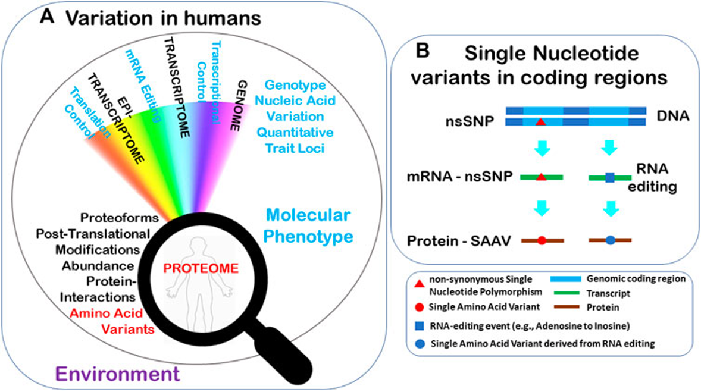

# Introducción a la Ciencia de Datos
**Materia:** Ciencia de Datos — Séptimo Semestre  
**Licenciatura en Nanotecnología (UNAM)**  
**Semana 1:** Sesiones 1 y 2 (4 horas)

---

## 📌 Tabla de Contenidos
1. [¿Qué es la ciencia de datos?](#1-que-es-la-ciencia-de-datos)
2. [Ciclo de los datos](#2-ciclo-de-los-datos)
3. [Tipo de los datos](#3-tipos-de-datos)
4. [Fuentes principales](#4-fuentes-principales-de-datos-en-nanociencias)
5. [Ciencia de datos VS enfoque tradicional](#5-informática-de-materiales-vs-método-tradicional)
6. [Ambiente de desarrollo](#6-ambiente-científico-computacional)

---

## 1. ¿Qué es la ciencia de datos?

Disciplina que combina matemáticas, estadística, programación, IA y machine learning con conocimientos específicos para encontrar información oculta en los datos. Esta información se puede utilizar para la toma de decisiones y la planificación.

## 2. Ciclo de los datos

## 3. Tipos de datos

## 4. Fuentes Principales de Datos en Nanociencias
* **Espectroscopía y Difracción:** Espectros UV-Vis, FTIR, Raman, XRD y XPS.
* **Microscopía Avanzada:** Imágenes de alta resolución provenientes de AFM, TEM y SEM.
* **Bases de Datos de Materiales:** Repositorios como *Materials Project*, *AFLOW* y *COD* con millones de estructuras y propiedades computadas.
* **Bases de Datos Biológicas**: NCBI (GenBank), UniProt y PDB para secuencias de nucleótidos y aminoácidos (usadas en Bionanotecnología y Nanomedicina).
* **Bases de Datos Químicas y Materiales**: PubChem, Materials Project y ChEBI para estructuras cristalinas, polímeros y nanoestructuras.

## 5. Informática de Materiales vs. Método Tradicional

| Paradigma | Enfoque Tradicional | Informática de Materiales (*Data-Driven*) |
| :--- | :--- | :--- |
| **Estrategia** | Prueba y error experimental (*Edisoniano*) | Screening virtual con Machine Learning |
| **Costo / Tiempo** | Meses o años por material sintetizado | Filtrado de miles de candidatos en horas |
| **Manejo de Datos** | Tablas aisladas y cuadernos físicos | Repositorios estructurados y pipelines reproducibles |
| **Escalabilidad** | Limitada a la capacidad humana en laboratorio | Modelos predictivos guiados por IA |

## 6. Ambiente Científico Computacional

Un entorno de cómputo científico moderno requiere herramientas que garanticen **reproducibilidad, eficiencia y claridad**.

### Componentes Clave
1. **Lenguaje Python:** El estándar mundial en ciencia de datos debido a su sintaxis clara y enorme ecosistema de librerías.
2. **Librerías Esenciales:**
   * `NumPy`: Cómputo numérico y manejo de matrices/vectores.
   * `Pandas`: Manipulación y estructuración de tablas de datos.
   * `Matplotlib` / `Seaborn`: Visualización gráfica de nivel de publicación.
3. **Jupyter Notebooks (`.ipynb`):**
   * El cuaderno interactivo actúa como una **bitácora de laboratorio digital**.
   * Permite mezclar texto enriquecido (Markdown), fórmulas matemáticas (LaTeX), código ejecutable y gráficas interactivas en un solo archivo.
4. **Github Copilot**: Util para el  Vibe coding y el control de versiones.

---

### 6.1. Práctica de: Code + Google Colab + Github Copilot

Buscar [Instalar VS Code](../manuales/pasos_vs_code_colab_github.md)

### Ventajas para la Clase
* **Cero Configuración:** No requiere instalar Python localmente.
* **Entorno Homogéneo:** Garantiza que todos los estudiantes trabajen exactamente en la misma versión.
* **Guardado en Drive:** Integración directa con Google Drive para bitácoras y entregas de prácticas. 